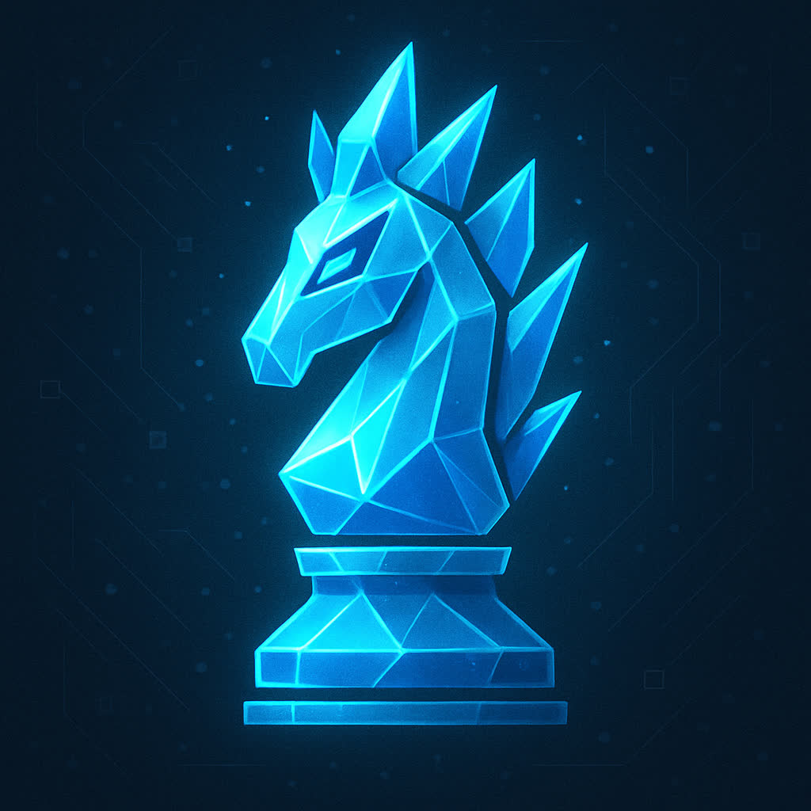

<p align="center">
  
</p>

<h1 align="center">Shard</h1>

**Shard** is a fast, UCI-compliant chess engine written in Rust. It currently supports most Universal Chess Interface commands and plays at an estimated strength of **2000+ Elo**.

# Gameplay
<p align="center">
  <a href="https://lichess.org/5KOfJKnE" target="_blank">
    
  </a>
</p>

# Features

- Full support for **UCI** commands for integration with GUIs like CuteChess, Arena, or Lichess bots.
- Capable of defeating weaker Stockfish variants with ease.
- Uses **quiescence search** to avoid horizon effects and evaluate only "quiet" positions.
- Written entirely in idiomatic **Rust**, with a focus on performance and correctness.

# How It Works

Shard’s strength comes from three core components:

- A handcrafted **evaluation function** that considers material balance, mobility, king safety, pawn structure, and more.
- A powerful **NegaScout (Principal Variation Search)** algorithm with alpha-beta pruning for efficient move selection.
- A **quiescence search** to extend evaluation in tactical positions and avoid shallow blunders.

```rust
// Example: NegaScout search snippet
fn negascout(...) -> i32 {
    let mut alpha = alpha;
    let mut beta = beta;
    let mut score;

    for (i, move) in moves.iter().enumerate() {
        make_move(move);
        score = if i == 0 {
            -negascout(..., -beta, -alpha)
        } else {
            let temp = -negascout(..., -alpha-1, -alpha);
            if alpha < temp && temp < beta {
                -negascout(..., -beta, -temp)
            } else {
                temp
            }
        };
        unmake_move(move);

        if score >= beta {
            return beta;
        }
        alpha = alpha.max(score);
    }

    alpha
}
```

# Getting Started

1. **Clone the repository**
   ```bash
   git clone https://github.com/Saphereye/shard.git
   cd shard
   ```

2. **Run the engine**
   ```bash
   chmod u+x run.sh
   ./run.sh
   ```

The `build.sh` script also copies the compiled binary to your `lichess-bot` integration project, if needed.

# License

This project is licensed under the **GNU GPLv3 License**.  
See the [LICENSE](LICENSE) file for full details.

# Contributing

Contributions, bug reports, and suggestions are welcome!  
Feel free to open an issue or submit a pull request.
