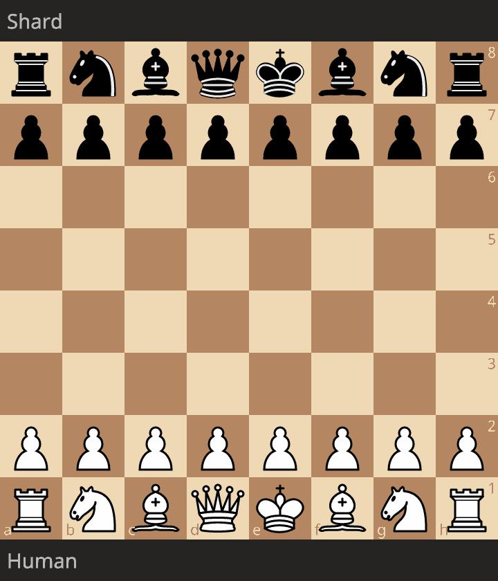

# Shard Chess Engine
**Shard** is a fast and hackable chess engine written in Rust.  
It supports the UCI (Universal Chess Interface) protocol and uses a Negamax search with alpha–beta pruning and is powered by an NNUE.

## Example Game
Here’s a sample game between me and Shard (result: 0–1).

<p align="center">
  
</p>


### PGN
```
[White "Saphereye"]
[Black "Shard"]
[Result "0-1"]
[ECO "A45"]
[GameDuration "00:08:22"]
[Opening "Indian Defense"]
[PlyCount "50"]
[TimeControl "40/300"]

1. d4 Nf6 {book} 2. Bf4 {1.7s} d5 {book} 3. e3 {0.94s} c5 {book} 4. c3 {1.5s}
Nc6 {book} 5. Nf3 {2.1s} Qb6 {book} 6. Be2 {3.9s} Nh5 {+4.21/13 91s}
7. Bg3 {25s} Nxg3 {+6.89/13 40s} 8. hxg3 {11s} Qxb2 {+6.90/13 32s} 9. Nbd2 {16s}
e6 {+6.46/12 30s} 10. Bd3 {26s} c4 {+6.74/11 21s} 11. Bc2 {3.8s}
Ba3 {+7.49/11 21s} 12. Ne5 {5.0s} Nxe5 {+9.97/13 30s} 13. dxe5 {17s}
b5 {+10.56/12 9.9s} 14. Bxh7 {31s} Bb7 {+10.55/10 5.3s} 15. Ke2 {9.7s}
O-O-O {+9.09/11 11s} 16. e4 {5.6s} Ba6 {+13.97/9 2.9s} 17. exd5 {1.5s}
Rxd5 {+13.43/10 2.3s} 18. Rb1 {3.7s} Qxc3 {+16.65/9 1.1s} 19. Ne4 {3.2s}
Qxe5 {+12.62/9 1.2s} 20. Kf1 {4.1s} Rxd1+ {+26.26/9 0.67s} 21. Rxd1 {1.6s}
c3 {+30.21/9 0.47s} 22. Rc1 {1.6s} b4+ {+47.88/10 0.48s} 23. Kg1 {12s}
Bxc1 {+45.83/10 0.40s} 24. f3 {12s} Be3+ {+289.93/9 0.31s} 25. Kh2 {1.2s}
Rxh7# {+289.99/10 0.15s, Black mates} 0-1
```

## Quickstart
Create the executable at `./target/release/shard` using
```bash
cargo build --release
```

This executable can be registered in a chess gui (e.g. cutechess) to play against.

## NNUE
Shard now supports **latest Stockfish NNUE format** (HalfKAv2_hm architecture) through a custom implementation.

**Important**: You must download and place an NNUE file in the `assets/` directory for optimal performance.

### Getting Latest NNUE Files
1. **Visit**: https://tests.stockfishchess.org/nns
2. **Download**: Latest NNUE file (e.g., `nn-1c0000000000.nnue`)
3. **Place** in `assets/nn-1c0000000000.nnue` or `assets/nn-latest.nnue`

The engine will:
- ✅ Load latest HalfKAv2_hm format networks
- ✅ Fall back to classical evaluation if no NNUE file found
- ✅ Support multiple filename variants

### NNUE-Guided Search with Confidence
Shard integrates NNUE evaluations throughout the search process with confidence adjustment:
- **Confidence-Based Move Ordering**: NNUE influence scaled by position confidence
- **Skeptical Extensions**: Only extend when confidence is high (>0.7)
- **Adaptive Pruning**: More aggressive pruning with high confidence, conservative with low
- **Dynamic LMR**: Reduction thresholds adjusted based on evaluation confidence

The engine is more skeptical of NNUE in:
- Opening positions (early game) - 70% confidence
- Tactical positions (extreme evaluations) - 60% confidence  
- Sparse positions (endgames with few pieces) - 80% confidence

See [NNUE_IMPROVEMENTS.md](NNUE_IMPROVEMENTS.md) for detailed documentation of these enhancements.

## License

This project is licensed under the GNU GPLv3 License. See the [LICENSE](LICENSE) file for details.
